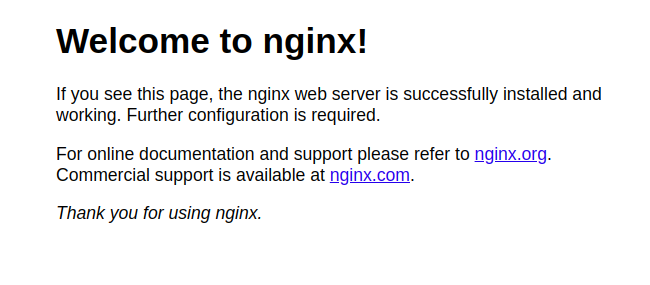

# Configuration Nginx

## Installing the Nginx Web Server

```bash
$ sudo apt update
$ sudo apt install nginx
```

## Enabling Firewall

After nginx installing success, the next step is enabling HTTP and HTTPS traffic to your server

```bash
$ sudo ufw allow 'Nginx Full'
```

When you running the command, you will allow HTTP and HTTPS traffic to your server. To check your firewall status, you can execute:

```bash
$ sudo ufw status
```


```bash
Status: active

To                         Action      From
--                         ------      ----
21/tcp                     ALLOW       Anywhere
Nginx Full                 ALLOW       Anywhere
21/tcp (v6)                ALLOW       Anywhere (v6)
Nginx Full (v6)            ALLOW       Anywhere (v6)
```


The result output isn't always same, it depend on your firewall configuration. After, allowing HTTP and HTTPS port, you can test the server is up or not by accessing your server public IP address in your browser.



If you see this page, it means you have successfully installed Nginx and enabled HTTP traffic for your server. HTTP traffic will be used when configuration SSL.


